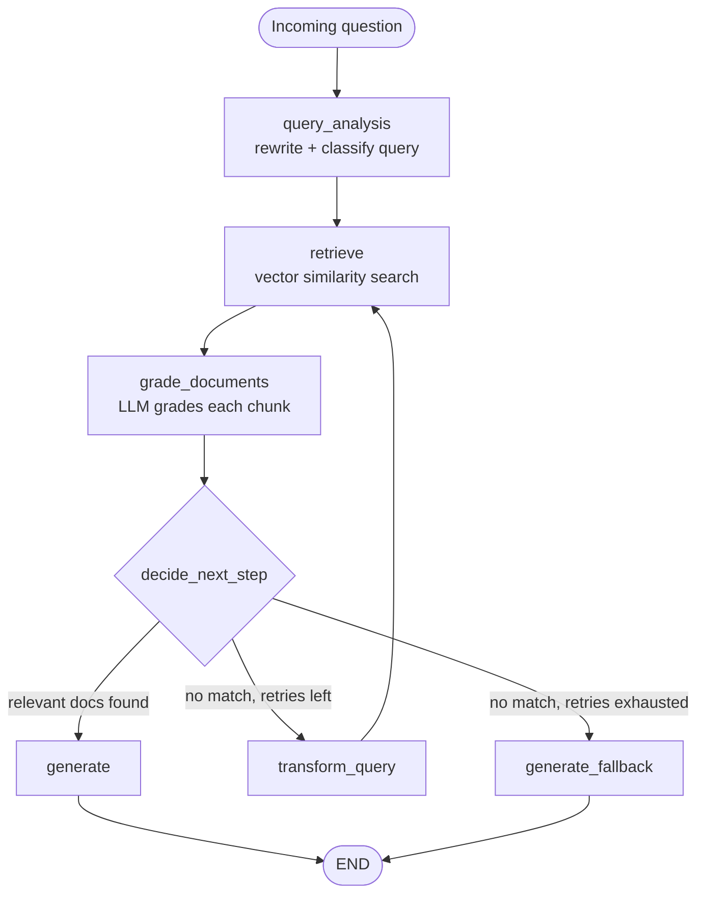
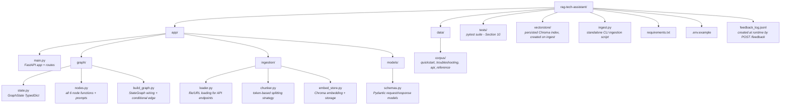

# RAG-Based Technical Documentation Assistant

A Retrieval-Augmented Generation system that answers questions about a small
corpus of FastAPI documentation, built with a self-corrective LangGraph
workflow (query analysis -> retrieval -> document grading -> generation, with a
conditional retry loop) and served via FastAPI.

Built for the Express Analytics AI/ML Engineer Intern take-home assignment.

---

## 1. Project Overview

The system ingests a mixed corpus of local Markdown files and fetched official documentation pages, indexes them in a Chroma vector store, and answers natural-language questions through a LangGraph pipeline that:

1. Rewrites/classifies the incoming question for better retrieval
2. Retrieves the top-k most similar chunks
3. Grades each chunk for actual relevance with an LLM (the self-corrective step), irrelevant chunks are filtered out
4. If nothing relevant survives grading, rewrites the query and retries
   (bounded by a retry limit) before falling back to an honest 'I don't know' response
5. Generates a final answer grounded only in the surviving relevant chunks,
   with inline citations

## 2. Architecture



**State schema** ('app/graph/state.py') tracks: the original question
(never mutated) separately from the current query (mutated on retry),
'retry_count' / 'max_retries' for loop control, 'documents' vs
'graded_documents' (raw retrieval vs. post-grading), and 'is_fallback' so the
API layer knows whether the answer came from real context or the fallback
path.

Full reasoning behind the state design and node choices is in
[Section 7](#7-design-decisions--tradeoffs).

## 3. Project Structure



## 4. Setup

### Prerequisites

- Python 3.11+
- A Groq API key (used for chat completions: query analysis, grading,
  generation). Embeddings run locally via sentence-transformers, so no key
  is needed for those.
- Optional: a Tavily API key if you wire up the web-search-fallback bonus.

### Install

```
bash
git clone <https://github.com/Joshika-jose-code/rag-tech-assistant.git>
cd rag-tech-assistant
python -m venv venv
source venv/bin/activate        # Windows: venv\Scripts\activate
pip install -r requirements.txt
cp .env.example .env            # then edit .env and add your GROQ_API_KEY
```

### Ingest the corpus

```
bash
python ingest.py --urls \
  <https://fastapi.tiangolo.com/tutorial/path-params/> \
  <https://fastapi.tiangolo.com/tutorial/dependencies/> \
  <https://fastapi.tiangolo.com/tutorial/query-params-str-validations/>
```

This indexes the 3 local files in 'data/corpus/' plus the 3 fetched URLs -
6 documents total. Add '--clear' to wipe and rebuild the vector store, or '--skip-local' to index only URLs.

### Run the API

```bash
uvicorn app.main:app --reload
```

API docs available at <http://localhost:8000/docs>.

## 5. Example Requests

### 'POST /query'

```bash
curl -X POST <http://localhost:8000/query> \
  -H "Content-Type: application/json" \
  -d '{"question": "How do I add a path parameter with type validation?"}'
```

```json
{
  "answer": "To add a path parameter with type validation, you can use the 'Path()' function from FastAPI and pass the desired validation keyword arguments.\n\nFor example, you can use 'gt', 'ge', 'lt', 'le' for numeric constraints [2], 'min_length', 'max_length' for string length constraints [2], or 'pattern' for a regex the string value must match [2].\n\nHowever, the context does not provide a specific example of how to use these validation keyword arguments with 'Path()'. It only lists the available validation keyword arguments [2].\n\nTo provide a complete answer, information on how to use these validation keyword arguments with 'Path()' is missing.",
  "sources": [
    { "source": "api_reference.md", "snippet": "...", "score": null },
    { "source": "api_reference.md", "snippet": "...", "score": null },
    { "source": "api_reference.md", "snippet": "...", "score": null }
  ],
  "is_fallback": false,
  "retries_used": 0
}
```

(Captured verbatim from a real request against the local corpus alone.
Note: It honestly flags that the exact 'Path()' syntax isn't spelled out in the retrieved context, rather than guessing at it.)

### Query that should trigger the fallback path

```bash
curl -X POST <http://localhost:8000/query> \
  -H "Content-Type: application/json" \
  -d '{"question": "How do I configure WebSocket authentication in FastAPI?"}'
```

```json
{
  "answer": "I couldn't find any relevant information in the documentation to provide a specific answer on configuring WebSocket authentication in FastAPI. It's possible that the details might be available in the source documentation or in more specialized resources.\n\nTo find the most accurate and up-to-date information, I recommend checking the official FastAPI documentation or related resources directly. You might also consider rephrasing your question or looking into community forums and discussions related to FastAPI, as these can often provide insights and solutions from experienced users and developers.",
  "sources": [],
  "is_fallback": true,
  "retries_used": 2
}
```

(The corpus deliberately doesn't cover WebSockets - this is a documented negative-case test; see Section 8. Also captured verbatim from a real
request.)

### 'POST /ingest/urls'

```bash
curl -X POST http://localhost:8000/ingest/urls \
  -H "Content-Type: application/json" \
  -d '{"urls": ["https://fastapi.tiangolo.com/tutorial/first-steps/"]}'
```

```json
{ "status": "success", "chunks_added": 48 }
```

(Chunk count depends on the live page's current length - 48 was accurate against the tutorial page's actual content at time of writing.)

### 'POST /ingest/files'

```bash
curl -X POST http://localhost:8000/ingest/files \
  -F "files=@my_notes.md"
```

### 'GET /documents'

```json
[
  { "filename": "api_reference.md", "chunk_count": 8 },
  { "filename": "quickstart.md", "chunk_count": 4 },
  { "filename": "troubleshooting.md", "chunk_count": 4 }
]
```

### 'POST /feedback'

```bash
curl -X POST http://localhost:8000/feedback \
  -H "Content-Type: application/json" \
  -d '{"question": "How do I add a path parameter?", "answer": "...", "rating": "up"}'
```

```json
{ "status": "recorded" }
```

## 6. Chunking & Embedding Strategy

- **Splitter**: 'RecursiveCharacterTextSplitter.from_tiktoken_encoder', with a
  separator priority of markdown headers -> paragraphs -> lines -> sentences -> words. Token-based sizing (300 tokens, 50 overlap) rather than raw
  character count, since token count is what actually governs embedding
  input limits and LLM context budget - a character-based split can
  silently produce wildly different token counts depending on content
  density (code vs. prose).
- **Why prioritize header boundaries**: technical docs are structured around
  headers far more than narrative prose is; splitting on '##'/'###'
  boundaries first keeps a concept and its explanation together rather than
  slicing mid-thought.
- **Overlap (50 tokens, ~15%)**: preserves continuity across a chunk
  boundary - e.g. a sentence that references "the previous example" doesn't
  lose that antecedent entirely.
- **Embedding model**: 'sentence-transformers/all-MiniLM-L6-v2', run locally
  via 'langchain-huggingface' - no API key or per-call cost, and good
  enough quality for a corpus this size.
- **LLM**: Groq-hosted Llama models - 'llama-3.3-70b-versatile' for
  generation and grading, and the smaller/faster 'llama-3.1-8b-instant' for
  query analysis and query rewriting, to stay within Groq's free-tier rate
  limit. Grading was originally on the 8B model too, but manual testing
  (5 obviously-irrelevant chunks against an unrelated question) showed it
  misclassified 3/5 as relevant via single-boolean-field tool-calling -
  a reasoning-field fix cut that to 2/5, but the 70B model got 0/5 wrong,
  so grading uses it despite the added Groq usage.
- **Vector store**: ChromaDB, chosen over FAISS because it persists to disk
  with metadata natively and its '.get()' method makes listing indexed
  sources for 'GET /documents' straightforward, without maintaining a
  separate metadata store as FAISS would require.

## 7. Design Decisions & Tradeoffs

**Explicit-node state machine over tool-calling agent.** LangGraph's official
"Agentic RAG" pattern lets the LLM itself decide whether to call a retriever
tool, using 'MessagesState'. I didn't use that pattern here - the assignment
explicitly specifies four named nodes and calls out state-schema design
(especially retry tracking) as a core evaluation criterion, which maps
directly onto the explicit 'TypedDict' + conditional-edge pattern used in
LangGraph's CRAG/Adaptive RAG references instead. The tool-calling pattern is
a reasonable alternative for a different kind of assignment, but it makes
retry counting and node-level responsibility much harder to point to
explicitly.

**'question' vs 'query' are separate fields.** The original question is never
mutated; 'query' is what gets rewritten on each retry. Generation is prompted
against the *original* question even though retrieval used the *rewritten*
query - otherwise a multi-hop rewrite could drift the final answer away from
what the user actually asked.

**Grading is per-chunk, not batched.** Each retrieved chunk gets its own LLM
grading call rather than grading all k chunks in a single call. This costs
more tokens/latency but avoids the failure mode where a single "grade these
4 chunks" call silently conflates or drops one. Batching is a reasonable
optimization if the LLM cost becomes a real constraint.

**'transform_query_node' is the single point where 'retry_count' increments.**
Keeping the increment in exactly one place was a deliberate choice to avoid
an off-by-one bug that would burn the retry budget faster than intended.

**'generate_fallback' is its own LLM-driven node, not a hardcoded string.**
This lets the "I don't know" response still reference the original question
naturally, rather than returning a generic canned message.

**Prompt-injection guard on grading and generation prompts.** Both prompts
explicitly instruct the model to treat retrieved content as data, not
instructions, and wrap chunks in 'context' tags. This is a mitigation, not
a hard guarantee - a sufficiently adversarial chunk could still partially
influence output. For a corpus of trusted official docs the risk is low, but
this matters more once '/ingest' accepts arbitrary user-submitted URLs/files.

**Split '/ingest/files' and '/ingest/urls' instead of one combined endpoint.**
FastAPI doesn't cleanly mix multipart file uploads with a JSON body in a
single endpoint; splitting also gives each path its own validation logic and
error semantics: 422 for ingestion-specific failures (unreachable URLs,
unsupported file types, empty files) and 500 for genuine server errors, on
both endpoints. '/ingest/urls' also hand-checks for an empty 'urls' list and
returns 400 - '/ingest/files' doesn't need an equivalent check, since
FastAPI's own required-field validation already returns 422 if 'files' is
missing, and there's no way to send "an empty list of files" over real
multipart HTTP the way a JSON body can send '"urls": []'.

**Feedback storage is a flat '.jsonl' file**, not a database. Sufficient for
a 2-day assignment; a SQLite table would be the natural upgrade if this went
further.

**'transform_query_node's prompt explicitly constrains output format** to a
single search string with no preamble, alternatives, or markdown. Without
that instruction, the rewrite model would sometimes return a whole
conversational response (explanation + multiple alternative query
suggestions), which - fed directly into 'similarity_search' - produces much
worse retrieval than the original query it was supposed to improve on.

**Grading uses '.with_retry()' plus a fail-safe exclusion, not just a
direct call.** Groq's tool-calling occasionally serializes the 'relevant'
boolean as the string '"false"' instead of a JSON boolean, which fails
Groq's own strict schema validation and raised an unhandled 'BadRequestError'
that crashed the whole query - reproduced reliably against a real chunk,
independent of model choice. Switching 'GradeResult''s structured-output
method from the 'with_structured_output' default of 'function_calling' to
'json_mode' fixed it at the root (0/15 failures afterward, vs. reliably
reproducible before); '.with_retry(stop_after_attempt=3)' and a
try/except-and-exclude in 'grade_documents_node' remain as defense-in-depth
against other transient failures (rate limits, connection errors), not as
the primary fix.

## 8. Assumptions

- The corpus is small enough (3 local docs, 6 total with the example URLs)
  that full-corpus re-ingestion on '--clear' is cheap; no
  incremental-update/dedup logic was built for re-ingesting an
  already-indexed file.
- Single-turn queries only - no conversation memory across requests (see
  below).
- Groq is the only chat-completion provider wired up; swapping providers
  would mean changing the 'ChatGroq' instantiations in 'nodes.py'. Embeddings
  are provider-agnostic already, since 'HuggingFaceEmbeddings' in
  'embed_store.py' runs locally.

## 9. What I'd Improve With More Time

- **Hallucination check** (Self-RAG style): a node after 'generate' that
  verifies the answer is actually supported by the retrieved context before
  returning it, looping back to regenerate or falling through to
  'generate_fallback' if not.
- **Web search fallback**: 'tavily-python' and 'TAVILY_API_KEY' are already
  wired into 'requirements.txt'/'.env.example', but the graph doesn't use
  them yet. If grading exhausts retries with nothing relevant, add a
  'web_search' node that queries Tavily before generating, rather than going
  straight to "I don't know."
- **Conversation memory**: add 'chat_history' to 'GraphState' and feed it
  into 'query_analysis' so follow-up questions ("what about the other one?")
  can resolve pronouns/context from prior turns.
- **Batched grading** to cut latency/cost once corpus size and query volume
  grow.
- **Score-aware retrieval**: switch 'similarity_search' to
  'similarity_search_with_score' so 'sources[].score' in the API response is
  a real number instead of always 'null'.
- **Ingestion dedup**: hash-check before re-adding a previously-ingested
  source to avoid duplicate chunks on repeated '/ingest' calls.

## 10. Testing

Run the full suite with:

```bash
pytest -v
```

Each test file targets a different layer, at the appropriate level of
mocking for what it's actually verifying:

- **'tests/test_chunker.py'**: real execution, no mocking - pure text
  processing, so there's nothing worth faking.
- **'tests/test_embed_store.py'**: real execution against the actual
  Chroma + HuggingFace embedding stack (isolated to a 'tmp_path' per test).
  Also guards against the eager-import bug directly: constructing the
  embedding model and vector store used to happen at module import time,
  which made merely *importing* 'embed_store.py' trigger a network call
  (downloading the embedding model) as a side effect. That's now lazy,
  built only on first 'get_vectorstore()' call, and
  'test_vectorstore_is_not_built_at_import_time' asserts it stays that way.
- **'tests/test_retry_loop.py'**: monkeypatches the six node functions at
  the 'app.graph.build_graph' module level with fakes, so 'decide_next_step'
  and the retry loop's termination behavior are tested against real
  'StateGraph' execution without any real LLM calls.
- **'tests/test_api.py'**: 'TestClient' with 'compiled_graph.invoke' itself
  mocked, so it verifies request validation and status-code semantics
  (400/422/500) at the FastAPI layer without exercising the graph at all.
- **'tests/conftest.py'** is intentionally empty. Earlier it set a dummy
  'OPENAI_API_KEY' / later 'GROQ_API_KEY' so that importing 'app.graph.nodes'
  wouldn't fail - that module used to build its 'ChatGroq' clients at
  import time, the same class of eager-construction bug as the one in
  'embed_store.py' above. Once that became lazy too (built on first call to
  'get_llm()' / 'get_small_llm()'), no dummy key was needed for imports to
  succeed, so the workaround was removed rather than kept as dead weight.
  Confirmed by running the full suite with '.env' entirely absent - all
  tests still pass with zero credentials present.

Manual, non-pytest verification that came out of this same process and is
worth knowing about if you're auditing correctness rather than just running
the suite: every graph node was invoked standalone against the real Groq
API and real vector store at least once (not just through mocks), and
every API endpoint was hit with real 'curl' requests against a running
server. That's how the grading-model reliability issue and the
malformed-tool-call crash described in Sections 6-7 were actually found -
neither would surface from mocked tests alone.
