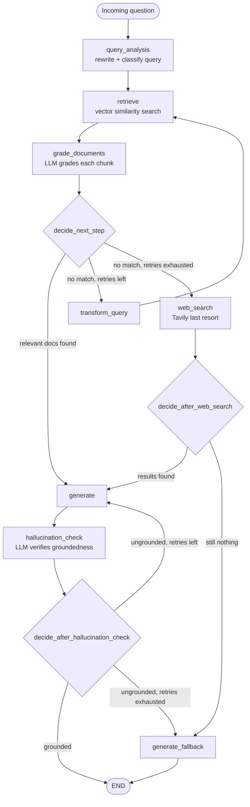

# RAG-Based Technical Documentation Assistant

A Retrieval-Augmented Generation system that answers questions about a small
corpus of FastAPI documentation, built with a self-corrective LangGraph
workflow (query analysis -> retrieval -> document grading -> generation ->
hallucination check, with a conditional retry loop and a web-search last
resort), served via FastAPI, and fronted by a Streamlit chat UI.

Built for the Express Analytics AI/ML Engineer Intern take-home assignment.

---

## 1. Project Overview

The system ingests a mixed corpus of local Markdown files and fetched official documentation pages, indexes them in a Chroma vector store, and answers natural-language questions through a LangGraph pipeline that:

1. Rewrites/classifies the incoming question for better retrieval
2. Retrieves the top-k most similar chunks
3. Grades each chunk for actual relevance with an LLM (the self-corrective step), irrelevant chunks are filtered out
4. If nothing relevant survives grading, rewrites the query and retries
   (bounded by a retry limit); once that retry budget is exhausted, tries a
   Tavily web search as a last resort before giving up
5. Generates a final answer grounded only in the surviving relevant chunks
   (local or web), with inline citations
6. Verifies the generated answer is actually supported by that context
   (a Self-RAG style hallucination check) before returning it - regenerating
   (bounded) if not, or falling through to an honest 'I don't know' response
   once that budget is also exhausted

## 2. Architecture



**State schema** ('app/graph/state.py') tracks: the original question
(never mutated) separately from the current query (mutated on retry),
'retry_count' / 'max_retries' for loop control, 'documents' vs
'graded_documents' (raw retrieval vs. post-grading), 'is_fallback' so the
API layer knows whether the answer came from real context or the fallback
path, 'grounded' / 'hallucination_retry_count' / 'max_hallucination_retries'
for the post-generation verification loop, and 'used_web_search' so the API
layer can tell when an answer's context came from Tavily rather than the
local corpus.

Full reasoning behind the state design and node choices is in
[Section 7](#7-design-decisions--tradeoffs).

## 3. Project Structure

```mermaid
flowchart TD
    Root[rag-tech-assistant/] --> App[app/]
    Root --> Data[data/]
    Root --> Tests[tests/<br/><i>pytest suite - Section 10</i>]
    Root --> VectorStore[vectorstore/<br/><i>persisted Chroma index, created on ingest</i>]
    Root --> Ingest[ingest.py<br/><i>standalone CLI ingestion script</i>]
    Root --> StreamlitApp[streamlit_app.py<br/><i>chat UI - thin HTTP client of the API</i>]
    Root --> Reqs[requirements.txt]
    Root --> EnvExample[.env.example]
    Root --> Feedback[feedback_log.jsonl<br/><i>created at runtime by POST /feedback</i>]

    App --> Main[main.py<br/><i>FastAPI app + routes</i>]
    App --> Graph[graph/]
    App --> Ingestion[ingestion/]
    App --> Models[models/]

    Graph --> State[state.py<br/><i>GraphState TypedDict</i>]
    Graph --> Nodes[nodes.py<br/><i>all 8 node functions + prompts</i>]
    Graph --> BuildGraph[build_graph.py<br/><i>StateGraph wiring + conditional edges</i>]

    Ingestion --> Loader[loader.py<br/><i>file/URL loading for API endpoints</i>]
    Ingestion --> Chunker[chunker.py<br/><i>token-based splitting strategy</i>]
    Ingestion --> EmbedStore[embed_store.py<br/><i>Chroma embedding + storage</i>]

    Models --> Schemas[schemas.py<br/><i>Pydantic request/response models</i>]

    Data --> Corpus[corpus/<br/><i>quickstart, troubleshooting, api_reference</i>]
```



## 4. Setup

### Prerequisites

- Python 3.11+
- A Groq API key (used for chat completions: query analysis, grading,
  generation). Embeddings run locally via sentence-transformers, so no key
  is needed for those.
- A Tavily API key ('TAVILY_API_KEY') to enable the web-search fallback.
  Without it, 'web_search_node' fails open (logs a warning, returns no
  results) and the graph falls straight through to the canned "I don't know"
  response once local retries are exhausted - the same behavior as before
  this feature existed.

### Install

```
bash
git clone <https://github.com/Joshika-jose-code/rag-tech-assistant.git>
cd rag-tech-assistant
python -m venv venv
venv\Scripts\activate
pip install -r requirements.txt
copy .env.example .env    
```

### Ingest the corpus

```
bash
python ingest.py --urls \
  <https://fastapi.tiangolo.com/tutorial/path-params/> \
  <https://fastapi.tiangolo.com/tutorial/dependencies/> \
  <https://fastapi.tiangolo.com/tutorial/query-params-str-validations/>
```

This indexes the 3 local files in 'data/corpus/' plus the 3 fetched URLs -
6 documents total. Add '--clear' to wipe and rebuild the vector store, or '--skip-local' to index only URLs.

### Run the API

```bash
uvicorn app.main:app --reload
```

API docs available at <http://localhost:8000/docs>.

### Run the UI

'streamlit_app.py' is a thin client of the API above - it talks to it
exclusively over HTTP (via 'requests'), so start the API first, then in a
second terminal:

```bash
streamlit run streamlit_app.py
```

UI available at <http://localhost:8501>. Enter a different backend URL in
the sidebar if the API isn't on 'localhost:8000'.

The UI covers the full pipeline, not just querying:

- **Chat**: ask a question and see the answer alongside status badges for
  'is_fallback', 'grounded', 'used_web_search', and how many retrieval
  retries / regenerations it took - the same transparency fields the API
  returns, made visible instead of requiring a raw JSON read. Sources are
  shown in a collapsible expander per answer.
- **Feedback**: 👍/👎 per answer, wired to 'POST /feedback'.
- **Document management** (sidebar): lists what's currently indexed
  ('GET /documents'), and lets you add more via file upload or a list of
  URLs ('POST /ingest/files' / 'POST /ingest/urls'), without needing 'curl'
  or 'ingest.py'.

## 5. Example Requests

### 'POST /query'

```bash
curl -X POST <http://localhost:8000/query> \
  -H "Content-Type: application/json" \
  -d '{"question": "How do I add a path parameter with type validation?"}'
```

```json
{
  "answer": "To add a path parameter with type validation, you can use the 'Path()' function from FastAPI and pass the desired validation keyword arguments.\n\nFor example, you can use 'gt', 'ge', 'lt', 'le' for numeric constraints [2], 'min_length', 'max_length' for string length constraints [2], or 'pattern' for a regex the string value must match [2].\n\nHowever, the context does not provide a specific example of how to use these validation keyword arguments with 'Path()'. It only lists the available validation keyword arguments [2].\n\nTo provide a complete answer, information on how to use these validation keyword arguments with 'Path()' is missing.",
  "sources": [
    { "source": "api_reference.md", "snippet": "...", "score": null },
    { "source": "api_reference.md", "snippet": "...", "score": null },
    { "source": "api_reference.md", "snippet": "...", "score": null }
  ],
  "is_fallback": false,
  "retries_used": 0
}
```

(Captured verbatim from a real request against the local corpus alone.
Note: It honestly flags that the exact 'Path()' syntax isn't spelled out in the retrieved context, rather than guessing at it. Captured before the
hallucination-check and web-search additions - the response shape has since
grown 'grounded', 'hallucination_retries_used', and 'used_web_search'; see
the web-search example below for those in context.)

### Query that should trigger the fallback path

```bash
curl -X POST <http://localhost:8000/query> \
  -H "Content-Type: application/json" \
  -d '{"question": "How do I configure WebSocket authentication in FastAPI?"}'
```

```json
{
  "answer": "I couldn't find any relevant information in the documentation to provide a specific answer on configuring WebSocket authentication in FastAPI. It's possible that the details might be available in the source documentation or in more specialized resources.\n\nTo find the most accurate and up-to-date information, I recommend checking the official FastAPI documentation or related resources directly. You might also consider rephrasing your question or looking into community forums and discussions related to FastAPI, as these can often provide insights and solutions from experienced users and developers.",
  "sources": [],
  "is_fallback": true,
  "retries_used": 2
}
```

(The corpus deliberately doesn't cover WebSockets - this is a documented negative-case test; see Section 8. Also captured verbatim from a real
request, before the web-search fallback existed - today, exhausting local
retries tries a Tavily search first and only reaches this canned response
if that also comes up empty.)

### Query that exhausts local retries and falls through to web search

```bash
curl -X POST <http://localhost:8000/query> \
  -H "Content-Type: application/json" \
  -d '{"question": "How do I connect a FastAPI app to a PostgreSQL database using SQLAlchemy'\''s async session?"}'
```

```json
{
  "answer": "The provided context does not contain information on how to connect a FastAPI app to a PostgreSQL database using SQLAlchemy's async session. The context appears to be related to the definition and usage of the word \"what\" in the English language, with sources from Merriam-Webster, YouTube, Wiktionary, and Cambridge Dictionary. \n\nTo answer the question, information about FastAPI, PostgreSQL, and SQLAlchemy's async session is missing from the context.",
  "sources": [
    { "source": "https://www.merriam-webster.com/dictionary/what", "snippet": "...", "score": null },
    { "source": "https://www.youtube.com/watch?v=1kknnG7zhSE", "snippet": "...", "score": null },
    { "source": "https://en.wiktionary.org/wiki/what", "snippet": "...", "score": null },
    { "source": "https://dictionary.cambridge.org/us/dictionary/english/what", "snippet": "...", "score": null }
  ],
  "is_fallback": false,
  "retries_used": 2,
  "grounded": true,
  "hallucination_retries_used": 0,
  "used_web_search": true
}
```

(Captured verbatim - included here deliberately because it's the exact
response that exposed a real bug rather than a cherry-picked success case.
'used_web_search: true' confirms 'web_search_node' fired after local
retries were exhausted, but the Tavily results are dictionary definitions
of "what," not FastAPI/PostgreSQL content. Root cause and fix are in
Section 7's "Errors Faced & Fixes"; after the fix, the same question
searches Tavily with the original question text instead of the mangled
retry query, so it no longer degenerates like this. 'grounded: true' here
correctly reflects that the answer honestly said the context didn't
contain the information - the hallucination check isn't meant to judge
whether *retrieval* found the right thing, only whether the *generated
answer* stays faithful to whatever context it was given.)

### 'POST /ingest/urls'

```bash
curl -X POST http://localhost:8000/ingest/urls \
  -H "Content-Type: application/json" \
  -d '{"urls": ["https://fastapi.tiangolo.com/tutorial/first-steps/"]}'
```

```json
{ "status": "success", "chunks_added": 48 }
```

(Chunk count depends on the live page's current length - 48 was accurate against the tutorial page's actual content at time of writing.)

### 'POST /ingest/files'

```bash
curl -X POST http://localhost:8000/ingest/files \
  -F "files=@my_notes.md"
```

### 'GET /documents'

```json
[
  { "filename": "api_reference.md", "chunk_count": 8 },
  { "filename": "quickstart.md", "chunk_count": 4 },
  { "filename": "troubleshooting.md", "chunk_count": 4 }
]
```

### 'POST /feedback'

```bash
curl -X POST http://localhost:8000/feedback \
  -H "Content-Type: application/json" \
  -d '{"question": "How do I add a path parameter?", "answer": "...", "rating": "up"}'
```

```json
{ "status": "recorded" }
```

## 6. Chunking & Embedding Strategy

- **Splitter**: 'RecursiveCharacterTextSplitter.from_tiktoken_encoder', with a
  separator priority of markdown headers -> paragraphs -> lines -> sentences -> words. Token-based sizing (300 tokens, 50 overlap) rather than raw
  character count, since token count is what actually governs embedding
  input limits and LLM context budget - a character-based split can
  silently produce wildly different token counts depending on content
  density (code vs. prose).
- **Why prioritize header boundaries**: technical docs are structured around
  headers far more than narrative prose is; splitting on '##'/'###'
  boundaries first keeps a concept and its explanation together rather than
  slicing mid-thought.
- **Overlap (50 tokens, ~15%)**: preserves continuity across a chunk
  boundary - e.g. a sentence that references "the previous example" doesn't
  lose that antecedent entirely.
- **Embedding model**: 'sentence-transformers/all-MiniLM-L6-v2', run locally
  via 'langchain-huggingface' - no API key or per-call cost, and good
  enough quality for a corpus this size.
- **LLM**: Groq-hosted Llama models - 'llama-3.3-70b-versatile' for
  generation and grading, and the smaller/faster 'llama-3.1-8b-instant' for
  query analysis and query rewriting, to stay within Groq's free-tier rate
  limit. Grading was originally on the 8B model too, but manual testing
  (5 obviously-irrelevant chunks against an unrelated question) showed it
  misclassified 3/5 as relevant via single-boolean-field tool-calling -
  a reasoning-field fix cut that to 2/5, but the 70B model got 0/5 wrong,
  so grading uses it despite the added Groq usage.
- **Vector store**: ChromaDB, chosen over FAISS because it persists to disk
  with metadata natively and its '.get()' method makes listing indexed
  sources for 'GET /documents' straightforward, without maintaining a
  separate metadata store as FAISS would require.

## 7. Design Decisions & Tradeoffs

**Explicit-node state machine over tool-calling agent.** LangGraph's official
"Agentic RAG" pattern lets the LLM itself decide whether to call a retriever
tool, using 'MessagesState'. I didn't use that pattern here - the assignment
explicitly specifies four named nodes and calls out state-schema design
(especially retry tracking) as a core evaluation criterion, which maps
directly onto the explicit 'TypedDict' + conditional-edge pattern used in
LangGraph's CRAG/Adaptive RAG references instead. The tool-calling pattern is
a reasonable alternative for a different kind of assignment, but it makes
retry counting and node-level responsibility much harder to point to
explicitly.

**'question' vs 'query' are separate fields.** The original question is never
mutated; 'query' is what gets rewritten on each retry. Generation is prompted
against the *original* question even though retrieval used the *rewritten*
query - otherwise a multi-hop rewrite could drift the final answer away from
what the user actually asked.

**Grading is per-chunk, not batched.** Each retrieved chunk gets its own LLM
grading call rather than grading all k chunks in a single call. This costs
more tokens/latency but avoids the failure mode where a single "grade these
4 chunks" call silently conflates or drops one. Batching is a reasonable
optimization if the LLM cost becomes a real constraint.

**'transform_query_node' is the single point where 'retry_count' increments.**
Keeping the increment in exactly one place was a deliberate choice to avoid
an off-by-one bug that would burn the retry budget faster than intended.

**'generate_fallback' is its own LLM-driven node, not a hardcoded string.**
This lets the "I don't know" response still reference the original question
naturally, rather than returning a generic canned message.

**Prompt-injection guard on grading and generation prompts.** Both prompts
explicitly instruct the model to treat retrieved content as data, not
instructions, and wrap chunks in 'context' tags. This is a mitigation, not
a hard guarantee - a sufficiently adversarial chunk could still partially
influence output. For a corpus of trusted official docs the risk is low, but
this matters more once '/ingest' accepts arbitrary user-submitted URLs/files.

**Split '/ingest/files' and '/ingest/urls' instead of one combined endpoint.**
FastAPI doesn't cleanly mix multipart file uploads with a JSON body in a
single endpoint; splitting also gives each path its own validation logic and
error semantics: 422 for ingestion-specific failures (unreachable URLs,
unsupported file types, empty files) and 500 for genuine server errors, on
both endpoints. '/ingest/urls' also hand-checks for an empty 'urls' list and
returns 400 - '/ingest/files' doesn't need an equivalent check, since
FastAPI's own required-field validation already returns 422 if 'files' is
missing, and there's no way to send "an empty list of files" over real
multipart HTTP the way a JSON body can send '"urls": []'.

**Feedback storage is a flat '.jsonl' file**, not a database. Sufficient for
a 2-day assignment; a SQLite table would be the natural upgrade if this went
further.

**'transform_query_node's prompt explicitly constrains output format** to a
single search string with no preamble, alternatives, or markdown. Without
that instruction, the rewrite model would sometimes return a whole
conversational response (explanation + multiple alternative query
suggestions), which - fed directly into 'similarity_search' - produces much
worse retrieval than the original query it was supposed to improve on.

**Grading uses '.with_retry()' plus a fail-safe exclusion, not just a
direct call.** Groq's tool-calling occasionally serializes the 'relevant'
boolean as the string '"false"' instead of a JSON boolean, which fails
Groq's own strict schema validation and raised an unhandled 'BadRequestError'
that crashed the whole query - reproduced reliably against a real chunk,
independent of model choice. Switching 'GradeResult''s structured-output
method from the 'with_structured_output' default of 'function_calling' to
'json_mode' fixed it at the root (0/15 failures afterward, vs. reliably
reproducible before); '.with_retry(stop_after_attempt=3)' and a
try/except-and-exclude in 'grade_documents_node' remain as defense-in-depth
against other transient failures (rate limits, connection errors), not as
the primary fix.

**Hallucination check runs after 'generate', not before it.** You can only
grade whether a *generated answer's claims* are supported by context once
that answer actually exists - there's no meaningful "pre-check" for
hallucination the way there is for document relevance. It reuses the same
full-model + 'json_mode' choice as document grading, for the same two
reasons documented above: the 8B model is measurably worse at single-boolean
judgment calls, and 'json_mode' avoids the same boolean-as-string failure
mode Groq's 'function_calling' path can produce.

**'hallucination_check_node' fails open on an unverifiable answer; 'grade_documents_node' fails closed on an unverifiable chunk.** These look
inconsistent but the cost of being wrong differs: an ungradeable *chunk*
still has up to 'TOP_K - 1' other candidates to fall back on, so excluding
it is nearly free. An ungradeable *answer* is the only answer generated so
far - discarding it (and spending a regeneration) over what's likely a
transient API hiccup is worse for the user than showing the unverified
answer. So grading failures exclude, but hallucination-check failures pass
through.

**'hallucination_retry_count' increments inside 'generate_node', not
'hallucination_check_node'.** This mirrors 'transform_query_node' being the
single place 'retry_count' increments (see above): the node that actually
performs the retry action owns advancing the budget, rather than splitting
"decide to retry" and "count the retry" across two different functions
where the increment is easy to lose track of or double up.

**Regeneration includes a corrective note in the prompt, rather than a
blind retry.** The generation model runs at 'temperature=0', so simply
re-invoking the same chain with the same inputs would very likely reproduce
the same ungrounded answer and burn the entire retry budget for nothing.
Appending a note ("your previous answer included unsupported claims,
revise...") only when regenerating actually changes the input, giving the
retry a real chance to fix the answer instead of repeating it.

**Web search results skip a dedicated relevance-grading pass.** Grading
them would cost another round of LLM calls to re-judge relevance for a
question Tavily's own search already targeted, and 'hallucination_check_node'
downstream still verifies the eventual answer against whatever came back -
so a bad or irrelevant web result can't silently produce an ungrounded
response; at worst it triggers a regeneration or the canned fallback,
the same as any other cause of a failed grounding check.

**Web search is a strict last resort behind the local retry loop, not a
parallel or first-choice source.** 'decide_next_step' only routes to
'web_search' once local retries are exhausted. This keeps the system biased
toward the curated local corpus and only reaches for the open web once
that's demonstrably insufficient - consistent with treating the indexed
docs as the primary source of truth.

**'web_search_node' fails closed to "no results" on any error**, rather
than propagating the exception. A missing 'TAVILY_API_KEY', a network
failure, or a malformed Tavily response are all caught and treated as an
empty result set, which 'decide_after_web_search' routes straight to
'generate_fallback' - so a misconfigured or absent Tavily key degrades
gracefully to the pre-existing fallback behavior instead of 500ing the
whole '/query' request.

**The Streamlit UI is a separate process that talks to the API over HTTP,
not a direct import of the graph.** 'streamlit_app.py' calls 'requests.post("/query")' etc. exactly like the 'curl' examples in Section 5, rather than
importing 'compiled_graph' directly into the same process. This costs an
extra process/port to run locally, but keeps the API as the single source
of truth for request validation and response shape - the UI can't drift
from what 'curl' or any other client sees, and the same backend could serve
multiple UIs (or none) without change.

**Chat history lives only in Streamlit's 'session_state', not the backend.**
The API is single-turn/stateless by design (see Section 8's assumptions) -
'GraphState' has no conversation memory, so there is nothing server-side to
persist across turns yet. The UI's chat log is a client-side convenience
for reviewing the current session, not a substitute for the "conversation
memory" improvement listed in Section 9; a page refresh clears it.

### Errors Faced & Fixes

Two real issues surfaced from manually inspecting actual '/query' responses
during this round of additions (not from a crash or a failing test) -
included here because both would have shipped invisibly otherwise:

1. **Misleading source snippets.** A response citing 'troubleshooting.md'
   showed a 300-character snippet about an unrelated "no current event
   loop" error for an answer that was actually about CORS. Root cause,
   confirmed by reading the source Markdown directly: the splitter had
   merged two short, adjacent '##' sections (event-loop troubleshooting and
   CORS troubleshooting) into a single ~300-token chunk, and the truncated
   preview happened to land entirely within the first section. The model
   had used the whole chunk correctly - only the *displayed preview* was
   misleading. **Fix**: 'sources[].snippet' now returns the full chunk
   ('doc.page_content') instead of the first 300 characters; chunks are
   already bounded to ~300 tokens by the splitter, so showing the whole
   thing is cheap and can't mislead the same way.

2. **Web search returning completely unrelated results.** The example in
   Section 5 above - a question about connecting FastAPI to PostgreSQL via
   SQLAlchemy's async session - triggered a Tavily search that returned
   dictionary definitions of the word "what." Root cause: 'web_search_node'
   searched Tavily using 'state["query"]', the field 'transform_query_node'
   rewrites on every retry ("try a different angle... do not repeat the
   previous query"); after two rounds of the small model's rewrites, it had
   degenerated into something close to meaningless. **Fix**: 'web_search_node'
   now searches 'state["question"]' - the original, never-mutated question -
   instead, since a general web search engine wants the real question, not a
   string tuned for local vector similarity search. Locked in with a
   regression test ('test_searches_original_question_not_rewritten_query' in
   'tests/test_web_search.py') that deliberately sets 'query' to something
   different from 'question' and asserts the fake Tavily client receives the
   question.

## 8. Assumptions

- The corpus is small enough (3 local docs, 6 total with the example URLs)
  that full-corpus re-ingestion on '--clear' is cheap; no
  incremental-update/dedup logic was built for re-ingesting an
  already-indexed file.
- Single-turn queries only - no conversation memory across requests (see
  below).
- Groq is the only chat-completion provider wired up; swapping providers
  would mean changing the 'ChatGroq' instantiations in 'nodes.py'. Embeddings
  are provider-agnostic already, since 'HuggingFaceEmbeddings' in
  'embed_store.py' runs locally.

## 9. What I'd Improve With More Time

(A hallucination-check node and a Tavily web-search fallback were both
originally listed here; both are now implemented - see Section 2's diagram
and Section 7's tradeoffs and "Errors Faced & Fixes.")

- **Conversation memory**: add 'chat_history' to 'GraphState' and feed it
  into 'query_analysis' so follow-up questions ("what about the other one?")
  can resolve pronouns/context from prior turns.
- **Batched grading** to cut latency/cost once corpus size and query volume
  grow.
- **Score-aware retrieval**: switch 'similarity_search' to
  'similarity_search_with_score' so 'sources[].score' in the API response is
  a real number instead of always 'null'.
- **Ingestion dedup**: hash-check before re-adding a previously-ingested
  source to avoid duplicate chunks on repeated '/ingest' calls.

## 10. Testing

Run the full suite with:

```bash
pytest -v
```

Each test file targets a different layer, at the appropriate level of
mocking for what it's actually verifying:

- **'tests/test_chunker.py'**: real execution, no mocking - pure text
  processing, so there's nothing worth faking.
- **'tests/test_embed_store.py'**: real execution against the actual
  Chroma + HuggingFace embedding stack (isolated to a 'tmp_path' per test).
  Also guards against the eager-import bug directly: constructing the
  embedding model and vector store used to happen at module import time,
  which made merely *importing* 'embed_store.py' trigger a network call
  (downloading the embedding model) as a side effect. That's now lazy,
  built only on first 'get_vectorstore()' call, and
  'test_vectorstore_is_not_built_at_import_time' asserts it stays that way.
- **'tests/test_retry_loop.py'**: monkeypatches the eight node functions at
  the 'app.graph.build_graph' module level with fakes, so 'decide_next_step'
  and the local-corpus retry loop's termination behavior are tested against
  real 'StateGraph' execution without any real LLM or Tavily calls.
- **'tests/test_hallucination_loop.py'**: same fakes-plus-real-'StateGraph'
  approach, focused on 'decide_after_hallucination_check' and the
  regenerate-or-fallback loop after 'generate' - including a check that the
  regeneration budget advances exactly once per loop iteration.
- **'tests/test_web_search.py'**: covers 'web_search_node' directly against
  a fake Tavily client (no real network calls) - result-to-'Document'
  conversion, dropping empty-content results, and failing closed on both
  search errors and client-construction errors - plus 'decide_after_web_search'
  routing and a full-graph check that 'web_search_node' is never invoked
  when local retrieval already succeeded. Also contains the regression test
  for the 'state["question"]' vs. 'state["query"]' bug described in
  Section 7.
- **'tests/test_api.py'**: 'TestClient' with 'compiled_graph.invoke' itself
  mocked, so it verifies request validation and status-code semantics
  (400/422/500) at the FastAPI layer without exercising the graph at all;
  its fake graph results now also cover the 'grounded' / 'hallucination_retries_used' / 'used_web_search' response fields.
- **'tests/conftest.py'** is intentionally empty. Earlier it set a dummy
  'OPENAI_API_KEY' / later 'GROQ_API_KEY' so that importing 'app.graph.nodes'
  wouldn't fail - that module used to build its 'ChatGroq' clients at
  import time, the same class of eager-construction bug as the one in
  'embed_store.py' above. Once that became lazy too (built on first call to
  'get_llm()' / 'get_small_llm()'), no dummy key was needed for imports to
  succeed, so the workaround was removed rather than kept as dead weight.
  Confirmed by running the full suite with '.env' entirely absent - all
  tests still pass with zero credentials present.

Manual, non-pytest verification that came out of this same process and is
worth knowing about if you're auditing correctness rather than just running
the suite: every graph node was invoked standalone against the real Groq
API and real vector store at least once (not just through mocks), and
every API endpoint was hit with real 'curl' requests against a running
server. That's how the grading-model reliability issue and the
malformed-tool-call crash described in Sections 6-7 were actually found,
and the same practice - reading real '/query' responses, not just checking
that they returned 200 - is how both issues in Section 7's "Errors Faced &
Fixes" (the misleading source snippet and the web-search query-drift bug)
were caught; neither would surface from mocked tests alone.
